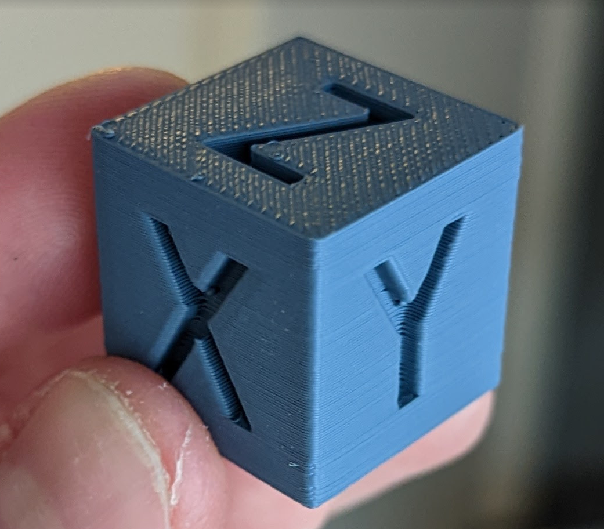

# Ender 3 S1 COREXZ

## Version 1.0

### Updated STLs to version 1.0

The parts should be printed in PETG or something equally or more stable (see: https://www.simplify3d.com/support/materials-guide/properties-table/)

- PETG (I used SUNLU black)
- Layer height: 0.25 first layer, 0.25 all layers
- 4 external perimeters, 0.8mm wall thickness
- 50% grid infill
- Supports (support enforcers only), snug supports (SuperSlicer)
    - See print orientation / supports used below

## List of materials
You can have a look in the `BOM.xlsx`

### All designed by me using cad.onshape.com
https://cad.onshape.com/documents/2d724dcc4f7a68835cdef02c/w/3ee8bb17d9ad95283a8c1cf1/e/ca4d997c7e1208501c988271

### Stepper mounts orientation

### Gantry mounts orientation

### Top mounts orientation

### Almost final version

---

Created initial version that works, able to print using current STLs, needs improvement.

Klipper still uses the input-shaping / pressure advance from the original lead screw z-axis setup. I will measure resonances and update the pressure advance once I have more solid corexz mounts.

### First print: https://youtube.com/shorts/suzz1N5mtw4

Second print: https://youtube.com/shorts/CWDbjbXojE4

Improved gantry mounts (printed with original COREXZ setup :), made it more solid and printed in PETG.
- 0.2mm layer height
- external perimeter speed 125mm/s
- other 200mm/s

Calibration cube video: https://www.youtube.com/watch?v=HerjxtBa1tQ

## Thanks
If you find any of my work useful or fun and want to say thanks in any way, feel free to buy me a beer or a coffee .. it definitely cost me a few of those while working on this project :P

https://www.paypal.com/donate/?business=YDJTXZLTJEKDJ&no_recurring=1&item_name=Buy+me+a+beer+or+coffee%21&currency_code=USD