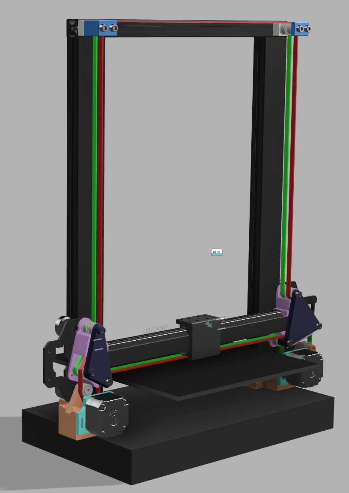
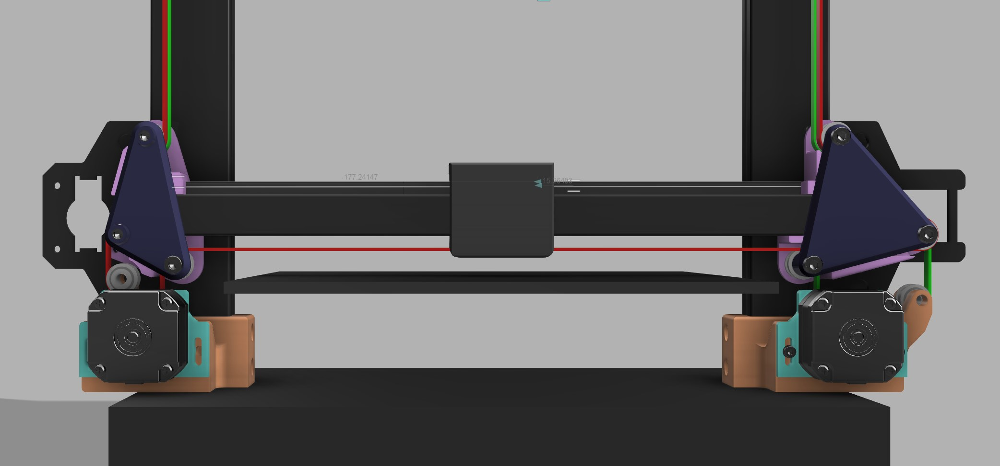
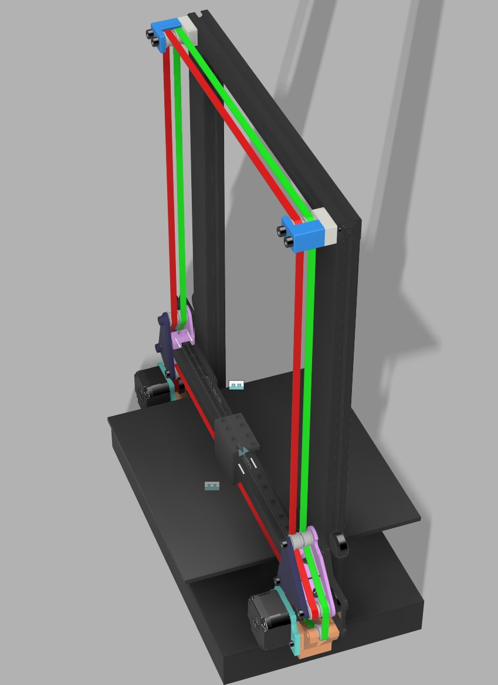
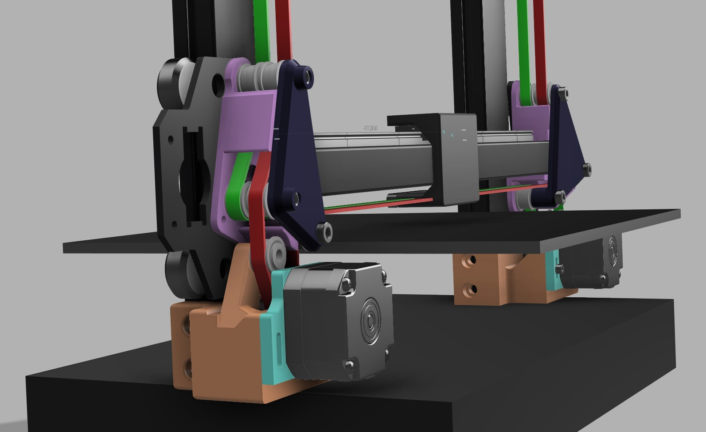
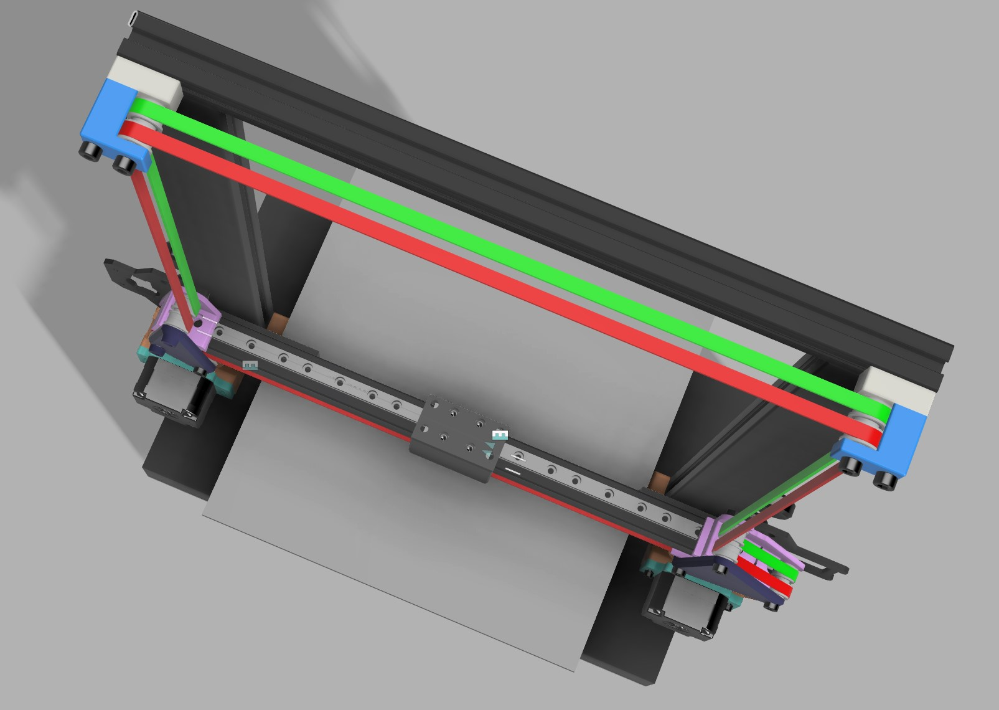
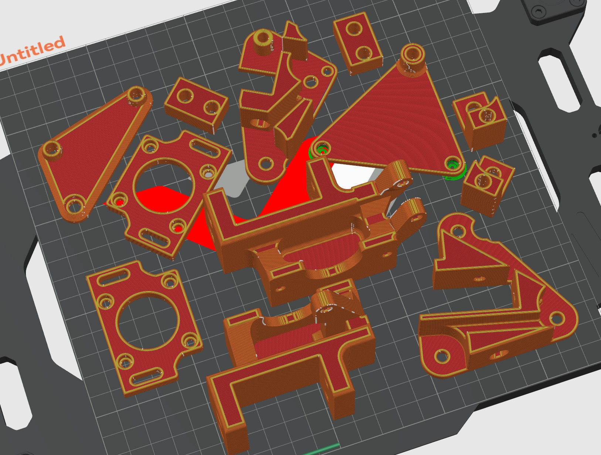
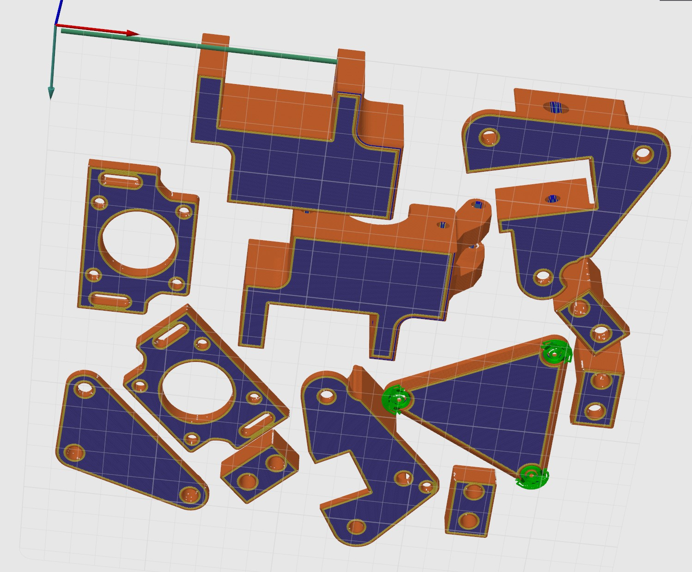
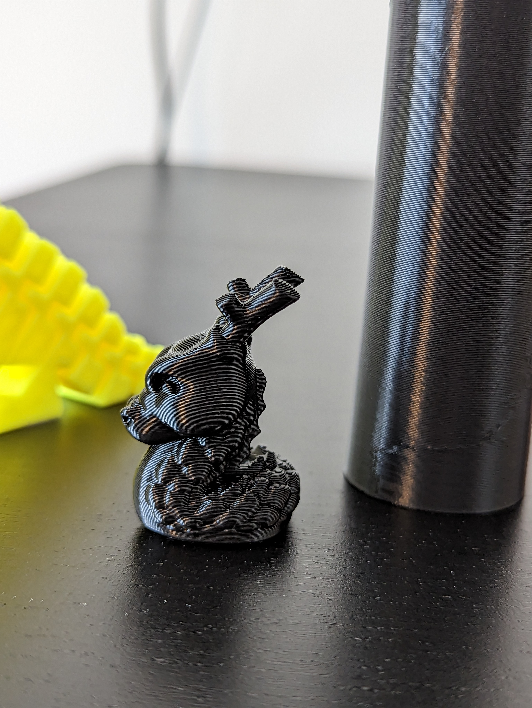
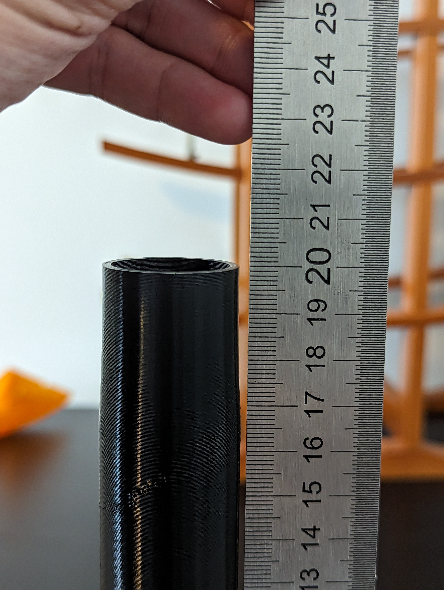
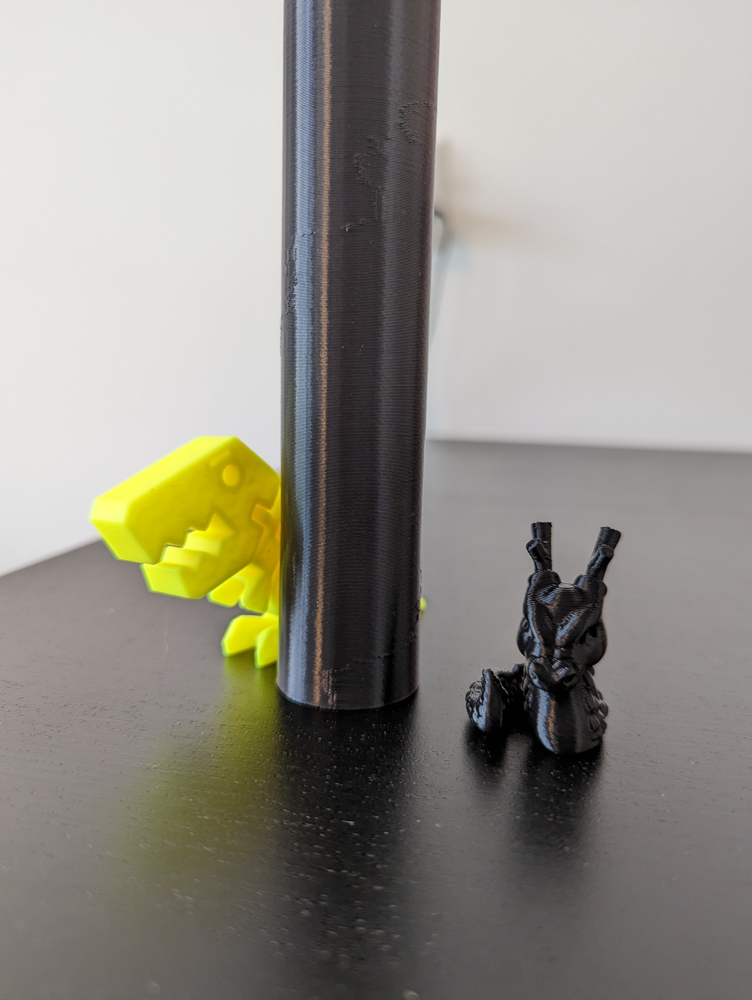

# Ender 3 S1 COREXZ

## Version 2.1

After some contemplating, I have decided to create a version 2 of the Ender 3 S1 corexz kinematics. It has a compact footprint, shorter belt path and more rigid design, albeit more sophisticated.

The two main motivations for version 2 were:
- Print quality focused
- Compact design
- Challenge CAD capabilities xd

Not a very high bar was set, but I achieved it and seems to have higher X-axis acceleration than previous versions (now ~13 000 compared to ~8000 before)

---

## ***** NOTE *****
## - This is not an easy / user friendly build, you have to remove the heated bed to mount the stepper mounts!
## - Also you have to rotate the top 2020 frame aluminium extrusion so the v-slot faces the front.

## ******************
---

## Print orientation / settings

Filament:
- Printed all the parts in eSUN PLA+ (EXCEPT the stepper flanges)
- Stepper motor flanges were printed in PETG (to withstand stepper motor heat)

### Slicer settigns
- 0.4mm nozzle
- 0.2mm first layer height
- 0.24mm layer height for the rest
- 3 walls, 4 top, 3 bottom
- 0.42mm line width (default, internal solid infill, supports)
- 0.45mm line width (first layer, inner wall, outer wall, top surface, sparse infill)
- 20% grid infill for PLA parts, 20% gyroid infill for PETG
- Supports only needed for right gantry cover
    - normal snug supports
    - only on build plate

# Some prints using V2.1 Corexz

See it in action on my [youtube channel](https://www.youtube.com/@f0rgiv3n)

### Cali dragon
- 0.2 layer height
- 4k accelerations (limited by bed slinging Y-axis)
- 200mm/s inner walls
- 120mm/s outer walls
- square corner velocity 5 external, 9 internal

### Z-axis accuracy, target 200mm -> result 200mm

### Uniform Z-layers

---

## Thanks
If you find any of my work useful or fun and want to say thanks in any way, feel free to buy me a beer or a coffee .. it definitely cost me a few of those while working on this project :P

https://www.paypal.com/donate/?business=YDJTXZLTJEKDJ&no_recurring=1&item_name=Buy+me+a+beer+or+coffee%21&currency_code=USD